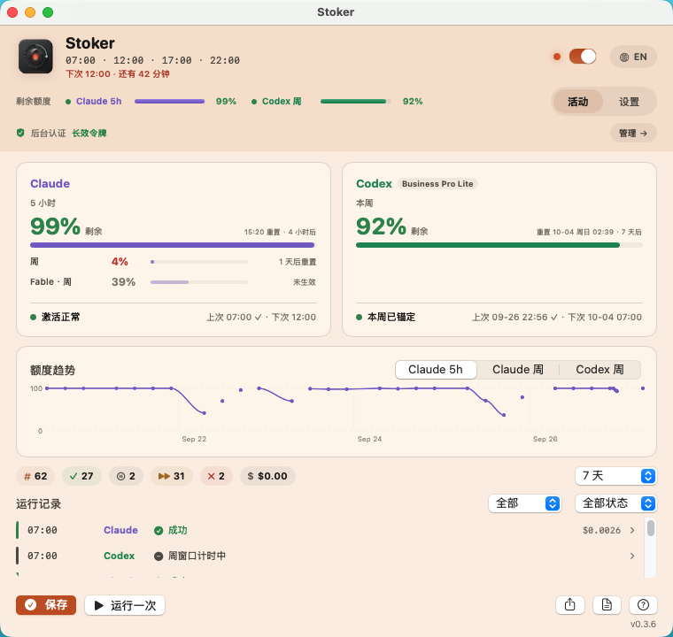
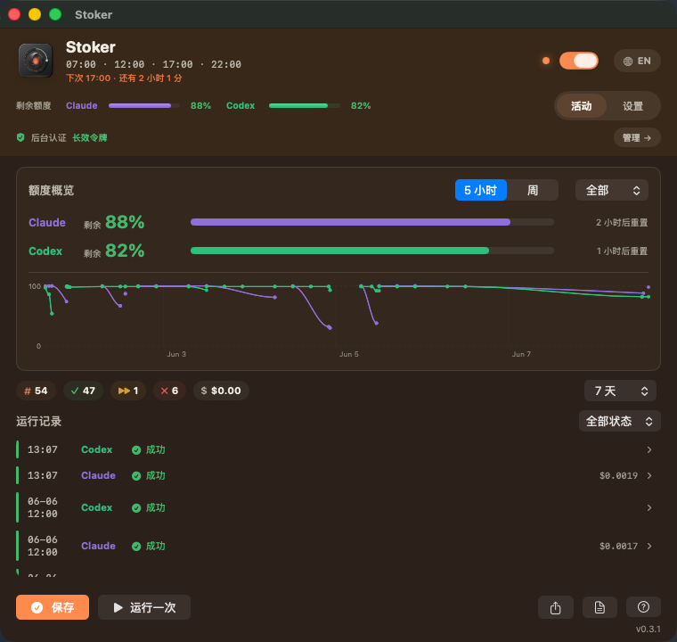
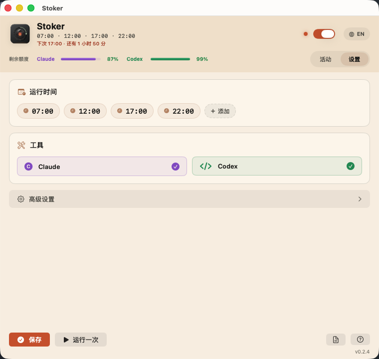
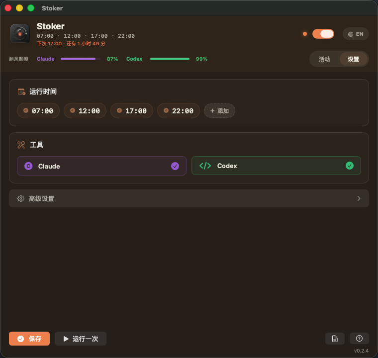
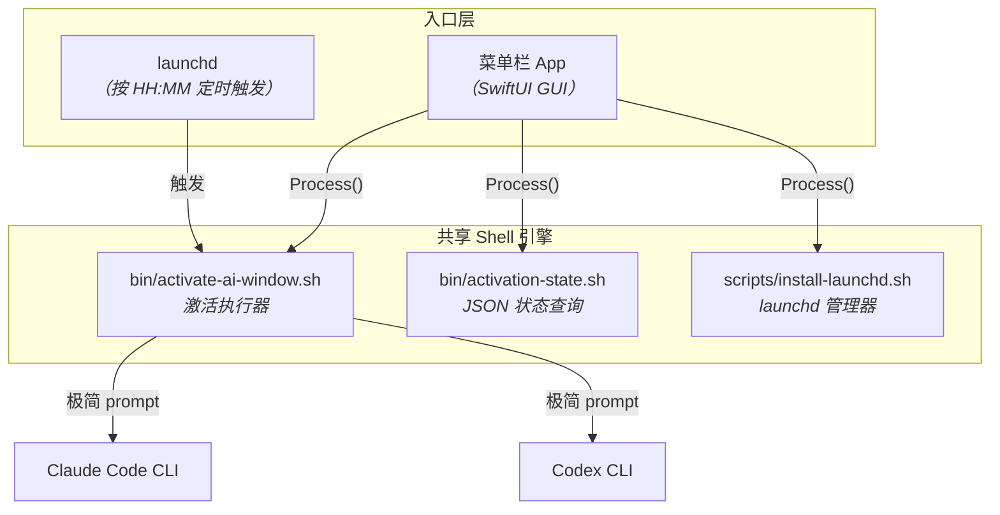

<div align="center">

[English](README.md) · [中文](README_CN.md)


# Stoker

**按你的作息，把 Claude Code 和 Codex 的用量窗口一直「续上火」。**

一个很小的 macOS `launchd` 定时器：按固定时间轻量触发 Claude Code 和 Codex，并记录触发日志、
单次 usage 和额度状态快照（Claude：5 小时 + 周窗口；Codex 自 2026 年 9 月起只有 7 天周窗口，Stoker 每周锚定一次）。

[](https://github.com/hakupao/stoker/actions/workflows/ci.yml)
[](LICENSE)
[](#环境要求)
[](CHANGELOG.md)
[](https://stoker.bojiangz.com/)


[网站](https://stoker.bojiangz.com/) · [功能](#功能) · [快速开始](#快速开始) · [菜单栏-app](#菜单栏-app) · [工作方式](#工作方式) · [成本优化](#成本优化) · [配置](#配置) · [下载](https://github.com/hakupao/stoker/releases/latest)

<br/>

<table>
  <tr>
    <td align="center"><sub><b>活动 · 浅色</b></sub><br/></td>
    <td align="center"><sub><b>活动 · 深色</b></sub><br/></td>
  </tr>
</table>

</div>

## 项目简介

Stoker（司炉——锅炉房里负责不停添煤、让炉火长燃不灭的人）适合想把 Claude Code / Codex 用量窗口
固定到自己作息时间的人。它就像替你守着那簇火：通过 macOS `launchd` 定时运行，在一个专用轻量目录里
让两个 CLI 只回复 `READY`，并明确要求不要扫描真实项目、不要运行工具、不要修改文件。

默认触发时间是本机时间 `07:00`、`12:00`、`17:00`、`22:00`。

## 功能

| | 功能 |
| :---: | :--- |
| ⏰ | **定时触发** —— 使用 macOS `launchd` 定时触发 Claude Code 和 Codex。 |
| 🪶 | **极短 prompt** —— 要求两个 CLI 不读文件、不运行工具、不修改内容。 |
| 📜 | **可读运行历史** —— `logs/activation.log` 记录人类可读的运行历史。 |
| 📊 | **结构化 usage** —— `logs/usage.jsonl` 记录每次真实触发返回的 token/usage 信息。 |
| 🔋 | **额度快照** —— `logs/status.jsonl` 记录 Claude 5 小时 + 周额度、Codex 周（7 天）额度快照。 |
| 🚦 | **额度预检** —— 真实触发前先检查额度；如果明确额度耗尽，会优雅跳过并记录日志。 |
| 🧬 | **可克隆配置** —— 通过 `.env` 配置时间、label、prompt、timeout 和工具路径。 |
| 🛟 | **安全手动命令** —— 支持 dry-run、依赖检查、只查额度、手动触发和卸载。 |

## 环境要求

- macOS 和 `launchctl`。
- Bash。
- 已登录的 Claude Code CLI。
- 已登录的 Codex CLI。
- `jq`：用于解析 JSONL 日志。
- Node.js：用于查询 Codex quota status。
- oh-my-claudecode（omc）插件：Claude 额度快照直接读取其本地用量缓存；只有
  `CLAUDE_STATUS_SOURCE=omc` 实时查询模式才需要 `omc` 命令本体。不想装插件？
  `CLAUDE_STATUS_SOURCE=native` 零额外安装即可跟踪 Claude 额度。

实际定时触发只依赖 Claude 和 Codex CLI；如果缺少 `omc`、`node` 或 `jq`，脚本会记录 warning
并跳过对应的结构化状态记录。

### 还没装 CLI？

Claude / ChatGPT 桌面 App 并不自带 CLI，但 CLI 的用量和 App 共享同一套订阅额度窗口——
所以习惯用 App 的用户同样能从 Stoker 受益。一次性安装，无需 Node 或 Homebrew：

```sh
# Claude Code CLI——装好后运行 `claude`，用你的 Claude 订阅登录一次
curl -fsSL https://claude.ai/install.sh | bash

# Codex CLI——装好后运行 `codex`，选 "Sign in with ChatGPT" 登录一次
curl -fsSL https://chatgpt.com/codex/install.sh | sh
```

只用其中一个？在 `.env` 里设 `ACTIVATION_TOOL=claude`（或 `codex`）即可——菜单栏 App 的
环境检查会跟随该设置，不再把另一个 CLI 当作必需项。

## 快速开始

先选择一种发布包：

- **CLI/launchd 包**：给 IT 高手和想保持极轻量的人，直接用 shell 控制。
- **菜单栏 App 包**：给小白初学者，用图形化界面监看和设置；底层仍然是同一套本地定时器。

### CLI / launchd

```sh
git clone https://github.com/hakupao/stoker.git
cd stoker
cp .env.example .env
./install.sh check
./install.sh dry-run
./install.sh
```

`./install.sh` 默认执行 `install`，会生成 LaunchAgent 并加载到当前 macOS 用户的 GUI session。

### 菜单栏 App

下载 GUI DMG，把 `Stoker.app` 拖到 `Applications` 后打开，然后在状态栏菜单里安装/重载 schedule、
刷新 quota、手动触发、暂停定时器和编辑设置。App 内置同一套 CLI engine，并会把工作副本放到
`~/Library/Application Support/Stoker/stoker`。

完整的新手和高手安装步骤见 [INSTALL_CN.md](INSTALL_CN.md)。

## 常用命令

```sh
./install.sh check        # 检查本机依赖
./install.sh dry-run      # 只展示命令，不发送模型 prompt
./install.sh quota        # 只查询额度状态，不发送模型 prompt
./install.sh app-status   # 输出菜单栏 App 使用的 JSON 状态
./install.sh status       # 查看 launchd 状态
./install.sh run-now      # 手动真实触发一次，会发送模型 prompt
./install.sh uninstall    # 卸载 LaunchAgent
./install.sh print-plist  # 打印生成的 launchd plist
```

也可以直接调用 runner：

```sh
./bin/activate-ai-window.sh --once
./bin/activate-ai-window.sh --status
./bin/activate-ai-window.sh --once --tool claude
./bin/activate-ai-window.sh --once --tool codex
```

## 日常运行检查

用下面几条命令判断定时器是否已经安装、是否正在等待触发、以及上次运行结果：

```sh
./install.sh status
tail -f logs/activation.log
tail -n 20 logs/usage.jsonl | jq
tail -n 20 logs/status.jsonl | jq
```

`./install.sh status` 应该能看到已加载的 LaunchAgent，以及你配置的日历触发时间。两次触发之间显示
`state = not running` 是正常的，它表示任务已经加载，正在等待下一个定时点。真正触发的短时间内才可能
显示 `running`。

`logs/activation.log` 是最适合日常看的文本日志。一次正常运行大致会像这样：

```text
Activation run started ...
Quota preflight started
Claude job started
Codex job started
Activation run finished exit=0
```

如果 quota preflight 判断额度已经耗尽，就不会发送 prompt，而是干净地记录跳过：

```text
claude job skipped by quota preflight reason=quota_exhausted
codex job skipped by quota preflight reason=quota_exhausted
```

`logs/usage.jsonl` 是结构化的成功/跳过记录。成功触发通常会包含 `ok: true`、`result: READY`
和 `exit_code: 0`。被跳过的触发会包含 `skipped: true` 和 `skip_reason`。

常用命令含义：

- `./install.sh status`：检查本地 `launchd` 是否已经加载定时器。
- `./install.sh quota`：只查额度状态，不发送 prompt。
- `./install.sh dry-run`：只打印计划执行的命令，不发送 prompt。
- `./install.sh run-now`：立刻触发已安装的 LaunchAgent；如果额度可用，可能消耗 usage。

## 配置

复制 `.env.example` 为 `.env`，按需修改：

| 变量 | 说明 | 默认值 |
| --- | --- | --- |
| `LABEL` | macOS LaunchAgent label | `com.stoker.ai-window` |
| `SCHEDULE_TIMES` | 逗号分隔的 `HH:MM` 触发时间，每个时间点相互独立 | `"07:00,12:00,17:00,22:00"` |
| `ACTIVATION_TOOL` | `all`、`claude` 或 `codex` | `all` |
| `ACTIVATION_PROMPT` | 发送给 CLI 的低消耗 prompt | `Reply exactly READY...` |
| `CLAUDE_CODE_OAUTH_TOKEN` | 由 `claude setup-token` 生成的长效 token，供无人值守认证（见下） | 未设置（用钥匙串登录） |
| `CODEX_MODEL` | Codex 激活模型；设为 `default` 则交给 Codex CLI 自行选择 | `gpt-5.6-luna` |
| `TIMEOUT_SECONDS` | 每个工具的超时时间 | `120` |
| `ENABLE_STATUS_SNAPSHOTS` | 真实触发后是否记录额度快照 | `1` |
| `ENABLE_QUOTA_PREFLIGHT` | 发送 prompt 前是否先检查额度 | `1` |
| `QUOTA_PREFLIGHT_ON_UNKNOWN` | 无法确认额度时 `allow` 继续或 `skip` 跳过 | `allow` |
| `QUOTA_EXHAUSTED_THRESHOLD_PERCENT` | 剩余额度低于或等于该百分比时跳过 | `0` |
| `CODEX_AUTO_UPDATE` | **为 `1`（默认）时会无人值守地升级你的 Codex CLI**——想自己管理 Codex 版本请设为 `0`。在真实发送 Codex prompt 前执行 `codex update`（跳过、dry-run、check、status 时绝不执行），按间隔节流；失败或超时只告警 | `1` |
| `CODEX_AUTO_UPDATE_INTERVAL_HOURS` | 两次更新尝试的最小间隔小时数（记录在 `run/codex-update.last`，失败也记录） | `24` |
| `CODEX_UPDATE_TIMEOUT_SECONDS` | `codex update` 的超时时间 | `180` |
| `CODEX_MODEL_FALLBACK` | 为 `1` 时，若模型被拒（"model is not supported"），按顺序从 Codex 模型缓存中选下一个候选重试；其它错误不重试，也绝不改写 `.env` | `1` |
| `CODEX_MODEL_FALLBACK_MAX_TRIES` | 每次运行最多的备用模型重试次数（被拒模型逐个排除） | `3` |
| `CODEX_MODELS_CACHE` | 选择备用模型所用的 Codex 模型缓存（识别 `$CODEX_HOME`） | `~/.codex/models_cache.json` |
| `CODEX_ACTIVATE_ONLY_WHEN_IDLE` | `1` 或 `0`。Codex 自 2026 年 9 月起只有 7 天周窗口：为 `1` 时，周窗口已在计时则跳过 Codex 激活（原因 `window_already_active`），即 Stoker 每周锚定一次；`0` 则每次都发送。需 `ENABLE_QUOTA_PREFLIGHT=1` | `1` |
| `CLAUDE_STATUS_SOURCE` | `cache` 直接读 oh-my-claudecode 插件的本地用量缓存（不触碰任何凭证）；`native` 用钥匙串 token 只读查询用量接口——无需 omc，token 过期即跳过、绝不刷新；`omc` 强制 `omc wait status` 实时查询，无头运行时可能轮换钥匙串登录凭证 | `cache` |
| `CLAUDE_USAGE_CACHE_FILE` | 用量缓存路径覆盖（可选） | `~/.claude/plugins/oh-my-claudecode/.usage-cache-anthropic.json` |
| `CLAUDE_USAGE_USER_AGENT` | `native` 用量请求的 User-Agent；claude-code 形态的 UA 可避开该接口激进的 429 限流桶 | `claude-code/0.3.6` |
| `CODEX_STATUS_SOURCE` | `app-server`（默认）经 JSON-RPC 拉起 `codex app-server`（需 node + codex）；`native` 只读 HTTP 查询 ChatGPT 用量接口——读 `~/.codex/auth.json` 里的 token、绝不刷新、无需 app-server，并在支持的套餐上显示套餐档位与额度余额 | `app-server` |
| `CODEX_AUTH_FILE` | `native` 用的 Codex OAuth 凭证路径（识别 `$CODEX_HOME`） | `~/.codex/auth.json` |
| `CODEX_USAGE_API_URL` | Codex `native` 用量接口地址覆盖 | `https://chatgpt.com/backend-api/wham/usage` |
| `CODEX_USAGE_USER_AGENT` | Codex `native` 请求发送的 User-Agent | `codex_cli_rs/<ver> (darwin)` |
| `KEEP_AWAKE_MODE` | `off`、`during` 或 `always`；非 `off` 时真实定时触发会用 `caffeinate` 防止睡眠 | `off` |
| `KEEP_AWAKE_SECONDS` | 每次真实触发的防睡眠时长上限 | `900` |
| `CLAUDE_BIN` | Claude 路径覆盖 | 自动发现 |
| `CODEX_BIN` | Codex 路径覆盖 | 自动发现 |
| `JQ_BIN` | `jq` 路径覆盖 | 自动发现 |
| `NODE_BIN` | Node.js 路径覆盖 | 自动发现 |
| `OMC_BIN` | `omc` 路径覆盖 | 自动发现 |
| `PATH_VALUE` | launchd 和 runner 使用的 PATH | Homebrew/local/system 默认路径 |

**配置只有一份，CLI 和 App 共用。** `.env` 是唯一真相源。菜单栏 App 会把它管理的那几项设置——
时间表、工具选择、以及它暴露的防睡眠／配额等选项——写回同一个 `.env`，不改动其它键和注释。App
没有暴露的项继续走代码内置默认值，所以一份手写、纯 CLI 的 `.env` 可以很短。完整的变量清单和注释
在 `.env.example` 里。只用 CLI 的用户直接编辑 `.env`。

**无人值守认证（推荐）。** 默认情况下，定时的 `claude -p` 会复用你交互式 Claude Code 登录的
macOS 钥匙串凭证。那份凭证寿命很短，且每当你的交互式会话刷新它时就会被轮换掉——于是共用它的
无人值守任务可能报 `401 Invalid authentication credentials`，直到你重新登录。要让定时任务自给自足，
用 `claude setup-token` 生成一份长效 token 存进 `.env`：

```sh
claude setup-token          # 打开浏览器，输出 sk-ant-oat01-...
# 然后写入 .env：  CLAUDE_CODE_OAUTH_TOKEN="sk-ant-oat01-..."
```

这份 token 以你现有的 Claude 订阅身份认证、并计入订阅额度（**不产生额外 API 计费**）；由于它不再
和交互式会话共用钥匙串凭证，导致 401 的轮换问题随之消失。若某次仍认证失败，`activation.log` 现在
会打印一条明确指向 `claude setup-token` 的提示。

**也可以在菜单栏 App 里一键完成。** 打开 **设置 → 后台认证 → 配置长效令牌**，在弹出的浏览器中完成
登录，App 会自动运行 `claude setup-token`、抓取令牌并写入 `.env`——无需开终端、无需复制粘贴；并始终
提供「在终端运行 + 手动粘贴」（带格式校验）的兜底方式。

修改时间或 label 后，重新安装一次：

```sh
./install.sh install
```

> 独立的 `Stoker.app`（不是从克隆目录启动的那种）会把引擎和它自己的 `.env` 放在
> `~/Library/Application Support/Stoker/stoker`，与 CLI 仓库分开。如果两者都用，请编辑「拥有当前
> 已加载 schedule」的那一份；当两者指向不同副本时 App 会给出警示。

### 睡眠与唤醒

定时触发依赖 Mac 在计划时刻处于唤醒状态。macOS `launchd` **在 Mac 睡眠期间不会触发
`StartCalendarInterval` 任务**——唤醒后只补跑**一次**错过的任务（不会把睡眠期间错过的每个时间点都
补齐）。所以合盖／睡眠中的 Mac 会一直错过 check-in，直到下次唤醒。

`KEEP_AWAKE_MODE` **不会**唤醒睡着的 Mac；它只在**某次触发已经在运行时**防止睡眠
（`caffeinate -i`）。`always` 则额外在菜单栏 App 打开期间一直保持 Mac 唤醒。想让定时可靠命中那几个
时刻，请在那些时刻保持 Mac 唤醒（例如接通电源并关闭睡眠），或用 `pmset repeat wake …` 自行设定时
唤醒。Stoker 不会替你配置 `pmset`。

## 日志

```sh
tail -f logs/activation.log
tail -20 logs/usage.jsonl | jq
tail -20 logs/status.jsonl | jq
```

日志文件说明：

- `logs/activation.log`：人类可读的运行历史。
- `logs/usage.jsonl`：每个工具每次真实触发的 usage 快照。
- `logs/status.jsonl`：额度快照（Claude 5 小时 + 周；Codex 仅周窗口）。
- `logs/raw/`：Claude、Codex 和 status 查询的原始输出。
- `logs/launchd.out.log` / `logs/launchd.err.log`：launchd 的 stdout/stderr。

## 菜单栏 App

CLI/launchd 仍然是主引擎；菜单栏 App 是单独给初学者使用的 GUI 发布形态，提供 macOS 状态栏
控制面板，并共用同一份配置、schedule、quota 快照和日志。界面随系统明暗自动适配；当定时开启时，
整个窗口会从冷色「待机」配色整体「升温」到暖色 ember「激活」状态。

亮点：

- **活动仪表盘** —— 顶部告警横幅（仅在某工具需要关注时出现；点「查看」把运行记录筛选到该工具），
  下方是两张按身份色区分的工具卡：Claude（5 小时窗口为主指标，周窗口和各模型的周额度桶为次要行）、
  Codex（周窗口为主指标，带重置日期和天数倒计时，有重置券时一并显示），每张卡底部都有健康行
  （状态、上次运行、下次激活）。
  卡片下方是趋势切换器（`Claude 5h` / `Claude 周` / `Codex 周`）、可展开查看单次详情（token、费用、
  耗时、session）的运行记录时间线，以及统计条——「按计划跳过」（中性色）与「额度跳过」（警告色）
  分开显示——带「时间范围 / 状态 / 工具」筛选。
- **顶部与菜单** —— 头部迷你条标注 `Claude 5h` / `Codex 周`，各带一个健康色点；菜单栏下拉每个工具
  一行摘要；任一工具告警时菜单栏火苗图标叠加一个小红点，每 10 分钟重新检查一次，每次定时激活后也
  会很快重新检查，即使窗口没打开也一样。
- **设置** —— 拆成 Claude 设置卡（启用 + 后台认证）与 Codex 设置卡（启用、模型、自动更新 CLI、
  模型自动回退、仅空闲时激活），加上共用的高级选项（额度预检、运行后快照、防睡眠、开机自启）。
- **后台认证**（现在在 Claude 设置卡内）—— 一眼看清定时任务的认证方式，并一键配置长效
  `CLAUDE_CODE_OAUTH_TOKEN`，让定时任务不再退回会轮换的钥匙串登录（并提供手动粘贴兜底）。
- **双语界面**，右上角 EN / 中 一键切换；主题随系统明暗自动适配。
- **环境检查**，自动检测必需与可选的命令行工具。
- **运行记录可导出 CSV。**

**健康状态：**

| 工具 | 状态 | 界面文案 | 含义 |
| :--- | :--- | :--- | :--- |
| Claude | `unknown` | "暂无运行" | 还没有任何真实（非跳过）运行记录。 |
| Claude | `alert` | "连续 N 次失败" / "激活异常" | 最近 ≥2 次真实运行全部失败；或定时开启且最近 24 小时内 0 次成功。 |
| Claude | `warning` | "最近一次失败" | 最近一次真实运行失败。 |
| Claude | `ok` | "激活正常" | 最近一次真实运行成功。 |
| Codex | `alert` | "连续 N 次失败" / "激活异常" | 最近 ≥2 次真实运行全部失败（优先于窗口状态判定）。 |
| Codex | `warning` | "最近一次失败" | 最近一次真实运行失败。 |
| Codex | `exhausted` | "本周额度用尽" | 已锚定的周窗口已无剩余额度。 |
| Codex | `anchored` | "本周已锚定" | 周窗口重置时间仍在未来，且已被使用（已用 > 0，或本周期内有成功运行）。 |
| Codex | `pending` | "待锚定" | 窗口空闲、重置时间已过，或没有额度数据。 |
| 两者 | `disabled` | "未启用" | 该工具被 `ACTIVATION_TOOL` 排除——没有下次激活，也不会告警。 |

每个工具按上表顺序依次判定（对 Codex 而言，连续失败会覆盖窗口状态）。

<div align="center">
<table>
  <tr>
    <td align="center"><sub><b>设置 · 浅色</b></sub><br/></td>
    <td align="center"><sub><b>设置 · 深色</b></sub><br/></td>
  </tr>
</table>
</div>

本地构建 App：

```sh
./app/StokerMenuBar/build-app.sh
open "dist/Stoker.app"
```

App 不替代脚本，而是调用现有入口：

- `./install.sh app-status`：读取 JSON 状态。
- `./install.sh install`：保存设置后重新加载 LaunchAgent。
- `./install.sh run-now`、`quota`、`dry-run`、`uninstall`：对应菜单操作。

如果在 App 里设置 `KEEP_AWAKE_MODE=always`，菜单栏 App 打开期间会保持 macOS 醒着。即使 App
没开，定时触发仍然照常由 launchd 执行；`KEEP_AWAKE_MODE=during` 只保护真实触发运行期间。

## 发布打包

维护者可以用一条命令同时生成两种发布包：

```sh
./scripts/package-release.sh
```

`dist/` 下会按人群分开：

- `stoker-cli-<version>.tar.gz`：轻量 CLI/launchd 包。
- `stoker-gui-<version>.dmg`：给初学者的 GUI App 安装包。

`STOKER_PLAIN_DMG=1 ./scripts/package-release.sh` 会跳过 Finder 美化安装窗口、直接生成普通 DMG（供 CI 等无头环境使用）。
美化布局的 Finder 自动化也限时 60 秒，失败时回退为普通 DMG。
- `stoker-gui-<version>.zip`：GUI App 备用压缩包。

## 工作方式

### 架构总览

项目有两个入口——CLI 和菜单栏 App——共享同一套 shell 引擎：



### CLI 运行流程

当 launchd 到达预定时间（或你手动执行 `./install.sh run-now`）时，激活脚本按以下顺序执行：

1. **加载配置** —— 从 `.env` 读取 schedule、工具选择、额度设置和二进制路径。
2. **获取锁** —— 创建 `run/activation.lock` 防止并发；如果已有运行中的触发，第二次触发会被
   优雅跳过。
3. **额度预检**（可选） —— 在发送任何 prompt *之前*查询 Claude 和 Codex 的额度状态。如果某个
   工具的额度已耗尽，该工具会被跳过，跳过记录写入 `logs/usage.jsonl`。Claude 的分项周额度
   （`scoped_weekly`，如某个模型专属的限额）仅在账号当前确实受其限制（`is_active: true`）时计入。
   Codex（只有 7 天周窗口）若周窗口已在计时，也会被跳过（`window_already_active`）——
   见 `CODEX_ACTIVATE_ONLY_WHEN_IDLE`。
4. **发送 prompt** —— 对每个启用的 CLI 发送一个极简 prompt（`Reply exactly READY`）。Claude
   使用超轻量模式（见[成本优化](#成本优化)）。Codex 使用配置的轻量模型，并带上 `--ephemeral`、
   `--skip-git-repo-check`、`--sandbox read-only` 以及精简后的配置（见下文）。
5. **记录 usage** —— 用 `jq` 解析每个 CLI 的 JSON 输出，把结构化记录追加到 `logs/usage.jsonl`
   （token 数量、费用、session ID、模型、耗时等）。
6. **触发后快照**（可选） —— 激活后再做一次额度快照，追加到 `logs/status.jsonl`。
7. **释放锁** —— 删除 lock 目录，下一次定时触发就可以正常执行。

超时保护：每个 CLI 调用都封装在后台进程中，有可配置的超时时间（默认 120 秒）。如果 CLI 挂起，
先发 SIGTERM，2 秒后再发 SIGKILL。

### 菜单栏 App

SwiftUI App 是一层很薄的 GUI 壳——它自己不包含调度器或激活逻辑，所有操作都委托给同一套 shell
脚本：

| App 操作 | Shell 调用 |
| --- | --- |
| 读取状态 | `bin/activation-state.sh --json` |
| 开关定时器 | `install.sh install` 或 `install.sh uninstall` |
| 保存设置 | 写入 `.env`，然后 `install.sh install` |
| 手动触发一次 | `install.sh run-now` |

App 通过 Foundation 的 `Process()` 调用脚本，读取 stdout，再用 `JSONDecoder` 解析成 Swift
数据模型。

### 激活在哪个目录运行？

两个 CLI 都在 **stoker 项目目录本身**内被调用——永远不会进入你的真实项目。这是一个只包含脚本和
日志的轻量目录，CLI 没有东西可以扫描或修改。

| 安装方式 | 工作目录 | 谁创建的 |
| --- | --- | --- |
| CLI（`git clone`） | 你 clone 的仓库，如 `~/stoker` | 你手动 clone |
| 菜单栏 App（开发构建） | 同上，复用源码目录 | 同上 |
| 菜单栏 App（.app / DMG） | `~/Library/Application Support/Stoker/stoker/` | App 首次启动时自动从 bundle 拷贝脚本 |

目录是怎么找到的：

- **Shell 脚本**：`ROOT_DIR` 在运行时从脚本自身位置（`bin/`）向上取父目录。这意味着项目 clone
  到任何路径都能正常工作，无需手动改脚本。
- **菜单栏 App**：`ProjectLocator` 从 app bundle 向上遍历，寻找包含 `bin/activate-ai-window.sh`
  的目录。对于独立的 `.app`，会把 bundle 内的脚本拷贝到 Application Support 并以该副本作为工作
  根目录。

安装脚本会为 macOS `launchd` 生成带绝对路径的 plist，放到 `~/Library/LaunchAgents/`。plist
被 git ignore，因为它包含本机路径。

### 项目结构

```text
stoker/
├── bin/
│   ├── activate-ai-window.sh   ← 激活执行器
│   └── activation-state.sh     ← 给 App 用的 JSON 状态
├── scripts/
│   └── install-launchd.sh      ← launchd 安装/卸载
├── app/
│   └── StokerMenuBar/          ← SwiftUI 菜单栏 App
├── launchd/                    ← 生成的 plist（git ignore）
├── logs/                       ← 生成的日志
│   ├── activation.log
│   ├── usage.jsonl
│   ├── status.jsonl
│   └── raw/
├── .env.example
├── install.sh                  ← 用户入口
└── README_CN.md
```

GitHub Actions 只在 push 和 pull request 时校验仓库脚本。真正的定时触发始终运行在执行过
`./install.sh install` 的那台 Mac 本地。

## 成本优化

每次激活只需一次 API 往返——prompt 和响应加起来不到 300 tokens。成本的瓶颈在于 CLI 自动注入的
**系统 prompt**（CLAUDE.md、插件、MCP 工具描述、hooks 等），单次可超过 40 000 tokens。

Runner 会把两个 CLI 的上下文压缩到激活所需的最低限度：

### Claude

| 参数 | 作用 |
| --- | --- |
| `--model haiku` | 最便宜的模型（input ~$0.80/M，Opus ~$15/M） |
| `--system-prompt "Reply only: READY"` | 自定义极简系统 prompt |
| `--setting-sources ""` | 跳过加载 CLAUDE.md、hooks、插件指令——消除 ~40K tokens 的注入上下文 |
| `--effort low` | 最低推理力度 |
| `--strict-mcp-config --mcp-config '{"mcpServers":{}}'` | 空 MCP 配置——去掉所有工具描述 |
| `--tools ""` | 禁用所有内置工具 |
| `--disable-slash-commands` | 禁用 skills |

效果：**~170 input tokens，每次激活 ~$0.001**（优化前 ~40K tokens / ~$0.15）。

### Codex

| 参数 | 作用 |
| --- | --- |
| `--ignore-user-config` | 跳过 `~/.codex/config.toml`——去除插件、MCP、developer instructions |
| `--ignore-rules` | 跳过 `.rules` 文件 |
| `--model "$CODEX_MODEL"` | 使用配置的轻量激活模型（默认 `gpt-5.6-luna`） |
| `-c 'features.memories=false'` | 禁用 memories |
| `-c 'features.multi_agent=false'` | 禁用 multi-agent |
| `-c 'features.goals=false'` | 禁用 goals |
| `-c 'features.hooks=false'` | 禁用 hooks |
| `-c 'features.child_agents_md=false'` | 禁用 AGENTS.md 加载 |
| `-c 'model_reasoning_effort="low"'` | 最低推理力度 |

效果：**~22K input tokens**（优化前 ~32K）。Codex 内部系统 prompt（~22K）仍然是 token 底线。
默认模型为 `gpt-5.6-luna`：原默认的 `gpt-5.4-mini` 已于 2026 年 9 月对 ChatGPT 账号登录停用
（每次都返回 HTTP 400 "not supported when using Codex with a ChatGPT account"）。若想使用 Codex CLI
默认模型，可设置 `CODEX_MODEL=default`。

> **从 ≤ 0.3.5 升级：** 你的 `.env` 很可能仍写着 `CODEX_MODEL=gpt-5.4-mini`。引擎现在会记录 WARNING
> 并改用 `gpt-5.6-luna`；菜单栏 App 加载时也会自动迁移该值（点一次“保存”即写回）。只用 CLI 的话，
> 请手动修改 `.env` 里的 `CODEX_MODEL`。

**套餐变动时保持 Codex 可用。** 默认（`CODEX_AUTO_UPDATE=1`）Stoker **会无人值守地升级你的 Codex CLI**；
不想要可在 `.env` 设 `CODEX_AUTO_UPDATE=0`。真实发送 Codex prompt 前，引擎会执行 `codex update`（每
`CODEX_AUTO_UPDATE_INTERVAL_HOURS` 最多一次，受 `CODEX_UPDATE_TIMEOUT_SECONDS` 限时），并在 usage 记录里写入
`cli_update: {attempted, from, to, exit}`；更新失败绝不阻塞激活。若随后 Codex 拒绝所配置的模型
（"model is not supported"），会按顺序从 `~/.codex/models_cache.json` 选下一个候选重试：先是被拒模型自身的
`upgrade.model`，再按含 `luna`、`terra`、`sol`、其它分档（档内按 `priority` 升序）。只考虑可见、支持 `low`
推理力度且未过 `retirement_at` 的模型，被拒模型逐个排除；成功、遇到其它错误或达到
`CODEX_MODEL_FALLBACK_MAX_TRIES` 次即停止。每次尝试各写一条 usage 记录（重试带
`model_fallback: {from, to, attempt}`；被重试取代的失败记录带 `superseded_by_fallback: true`，App 不计为错误），
并输出 WARNING 提示你把 `CODEX_MODEL` 设为成功的模型。不会改写 `.env`。

### 月成本估算（每天 4 次激活）

| 工具 | 优化前 | 优化后 |
| --- | --- | --- |
| Claude | ~$18/月 | **~$0.16/月** |
| Codex | 按配额计算，~32K tokens/次 | 按配额计算，**~22K tokens/次（−31%）** |

## 安全说明

- `dry-run` 不会发送模型 prompt。
- `quota` 只查询账号/rate-limit 状态和本地 cache，不会发送模型 prompt。
- `run-now` 和定时触发会先做 quota preflight；只有额度看起来可用时，才给启用的工具发送一个很短的
  prompt。
- 如果明确额度已经耗尽，对应工具会被跳过，并在 `logs/usage.jsonl` 里记录 `skipped: true`。
- Claude 使用 `--model haiku`、`--setting-sources ""`、`--system-prompt`、`--effort low`、
  `--strict-mcp-config` 空配置、无 tools、无 slash commands、无 session persistence。详见
  [成本优化](#成本优化)。
- Codex 使用 `--model "$CODEX_MODEL"`、`--ephemeral`、`--skip-git-repo-check`、
  `--sandbox read-only`、`--ignore-user-config`、`--ignore-rules`，并禁用 memories、multi-agent、
  goals、hooks 等功能。
- 生成的 plist 会被 git 忽略，因为它包含本机绝对路径。

## 卸载

```sh
./install.sh uninstall
```

如果你从旧 label 迁移，可以安装时设置 `LEGACY_LABELS="old.label"`，这样旧 LaunchAgent 会被
清理，避免重复触发。

## 参与贡献

提交修改前建议先运行：

```sh
./scripts/validate.sh
```

更多说明见 [CONTRIBUTING.md](CONTRIBUTING.md)。

## 更新记录

版本变化见 [CHANGELOG.md](CHANGELOG.md)。

## 免责声明

Stoker 是一个独立的开源项目，与 **Anthropic、OpenAI、Apple 没有隶属关系，也未获其授权、认可或
赞助**。"Claude"、"Claude Code"、"Anthropic" 是 Anthropic 的商标；"Codex"、"ChatGPT"、"OpenAI"
是 OpenAI 的商标；"macOS"、"Apple" 是 Apple Inc. 的商标——这里仅用于标识 Stoker 所配合的工具。

Stoker 会代表你向 Claude Code 和 Codex CLI 发送自动「打卡」prompt，并消耗真实用量 / 额度。
**你需自行负责**确保使用符合 Anthropic 与 OpenAI 的服务条款、使用政策与速率限制，并自行承担由此
产生的费用或账号后果。本软件按「现状」提供，不附带任何担保。Stoker 完全在你本机运行，不会向项目
作者发送任何数据。

完整的免责声明、商标、隐私与第三方声明见 **[DISCLAIMER.md](DISCLAIMER.md)**；安全问题上报见
**[SECURITY.md](SECURITY.md)**。

## License

本项目使用 MIT License。详情见 [LICENSE](LICENSE)。
